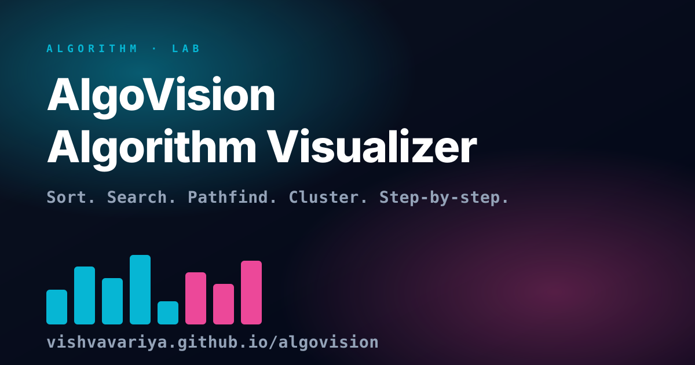

# AlgoVision — Interactive Algorithm Laboratory

**AlgoVision** is a high-fidelity interactive sandbox for exploring, debugging, and visualizing core algorithms. Built with **Next.js**, **React Three Fiber**, and **Framer Motion**, it provides a tactile and aesthetic experience for understanding complex logic through playful metaphors and precise technical traces.

**[🚀 Explore the Laboratory](https://vishvavariya.github.io/algovision)**

## ✨ Features

- **Data Lab**: Generate random, reversed, nearly sorted, or custom datasets to pressure-test algorithm edge cases.
- **Tactile UI**: Smooth animations, audio feedback, and a responsive mobile-first layout with safe-area support.

## 🧠 Algorithms Included

### Sorting
- Bubble Sort, Insertion Sort, Selection Sort, Quick Sort, Merge Sort, Heap Sort, Counting Sort, and the playful **Social Anxiety Sort**.

### Searching
- Linear Search, Binary Search, Jump Search.

### Graphs
- BFS, DFS, Dijkstra's Algorithm, Bellman-Ford, A* Search.

### Machine Learning & Strategy
- K-Means Clustering, Linear Regression, N-Queens Backtracking, Fibonacci (Dynamic Programming).

## 🛠️ Tech Stack

- **Framework**: [Next.js 16 (App Router)](https://nextjs.org/)
- **Visuals**: [React Three Fiber](https://r3f.docs.pmnd.rs/), [Three.js](https://threejs.org/), [Framer Motion](https://www.framer.com/motion/)
- **Styling**: [Tailwind CSS 4](https://tailwindcss.com/)
- **Analytics**: GA4 via custom `gtag` helpers
- **Testing**: [Vitest](https://vitest.dev/) & [React Testing Library](https://testing-library.com/docs/react-testing-library/intro/)

## 🎨 Design Principles

AlgoVision follows a "Playful Tech" aesthetic:
- **Dense Controls**: Useful, tactile knobs and sliders for power users.
- **Fluid Motion**: Purposeful animations that clarify state changes rather than just decorating them.
- **Accessible & Responsive**: Full keyboard navigation support and safe-area aware mobile layouts.

---

Built by [Vishva Variya](https://vishvavariya.com). Playful web experiments at [vishva.lol](https://vishva.lol).
